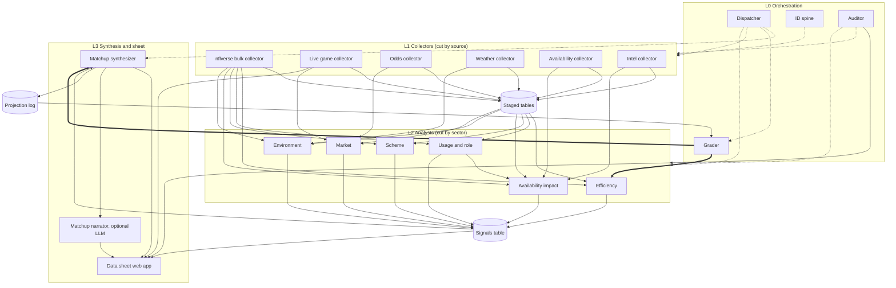

# Kickoff: NFL Data Sheet

You're starting in an empty folder. This message is the foundation for the whole project. Read all of it before doing anything. Your first job is **not** to build features. It's to turn this into durable project docs and a scaffold, then stop so I can review.

---

## 1. What we're building

A free-to-run NFL analytics system for one solo developer (me). Autonomous background jobs gather NFL data, analysts turn it into standardized signals, and a synthesizer turns signals into per-game matchup cards. Everything feeds a web app "data sheet" where a user can filter games and players, cross-reference any signal, and read matchup inferences with sample sizes and data freshness shown.

**Hard constraints**
- **$0/month running cost** (small optional exceptions noted in Phase 8 only).
- **"Agents" are deterministic Python jobs on GitHub Actions cron, not LLMs.** No LLM API calls anywhere in Phases 1–7.
- **Sourced data only.** Never fabricate, estimate, or fill gaps. Missing data stays null and is surfaced as missing.
- The 2026 season is in progress (currently around Week 2), so real data exists to validate against.

**About me:** Business Economics student, solo dev. Stack I know: Python, FastAPI, React/TypeScript, Next.js/Vercel, Supabase/Postgres, GitHub Actions. I read dense technical output fine; skip hand-holding, don't skip reasoning on decisions.

---

## 2. Architecture graph

Four layers plus stored tables. Solid arrows are data flow, dotted arrows are triggers, keys, or monitoring, and thick arrows are grading feedback.



**Layer rules (non-negotiable)**
- **L1 collectors** fetch, validate, and store. They never compute metrics.
- **L2 analysts** read only stored tables (never external sources) and write only to the signals table.
- **L3** reads signals and never calls external sources. The web app reads only our database.
- **L0** decides what runs, owns the canonical keys, detects breakage, and grades projections.

---

## 3. Piece-by-piece spec

Freshness tiers: **T0** every few minutes, **T1** hourly or several a day, **T2** daily, **T3** weekly, **OD** on demand.

### L0 Orchestration

| Piece | Tier | Phase | Job |
|---|---|---|---|
| Dispatcher | T0 | 1 (skeleton), 8 (tuned) | One GitHub Actions cron every ~10 min. Reads schedule and game state plus `agent_runs`, triggers only what the calendar needs (Section 7). Triggers nothing in idle windows. |
| ID spine | T2 | 1 | Canonical keys: games, teams, players, and an ID crosswalk (gsis ↔ ESPN ↔ Sleeper ↔ PFR) via nflreadpy `load_schedules`, `load_teams`, `load_players`, `load_ff_playerids`. Every table foreign-keys here. |
| Auditor | T0 | 1 (skeleton) | After each run: freshness vs expectation, row-count anomalies, schema drift, null spikes. Alerts via GitHub issue or Discord webhook; exposes per-domain staleness status for the UI. |
| Grader | T2 | 5 | Grades every locked projection after the game; tracks closing-line value by signal and sector; writes calibration used by the efficiency analyst and synthesizer. |

### L1 Collectors

| Collector | Source(s) | Reliability | Tier | Phase | Stores |
|---|---|---|---|---|---|
| nflverse bulk | nflreadpy: pbp, player and team stats, snap counts, NGS, PFR advanced, FTN charting, depth charts, rosters | Open data | T2 | 2 | Aggregates only (player_week, team_week, snaps, ngs, ftn, depth). **Never raw pbp in Postgres.** |
| Live game | ESPN scoreboard and game summary (unofficial) | Can break | T0 | 8 | live_games, live_box, espn_lines |
| Odds | The Odds API free tier + ESPN embedded lines as free fill-in | Credit-limited | T1 | 4 | odds_snapshots (append-only) |
| Weather | Open-Meteo (no key) + stadium coords, roof, surface | Open data | T1 | 4 | weather_snapshots (append-only), outdoor games only |
| Availability | ESPN injuries, Sleeper players (max once/day), NFL.com injury report pages | Can break | T1 | 3 | injuries, practice_status, transactions |
| Intel (live news) | ESPN NFL news feed (unofficial), official team site RSS where available, Sleeper trending players as a news-spike indicator | Can break | T1 | 7 | news_items (deduped by URL + text hash), news_tags (team, player_id, rule-based category: injury, depth chart, suspension, coaching, signing/release/trade) |

### L2 Analysts (all write to `signals`)

| Analyst | Phase | Signals |
|---|---|---|
| Efficiency | 2 | Opponent-adjusted EPA/play, success rate, explosive rate, points/drive, three-and-out rate, red-zone TD rate; pass/rush and down splits; garbage time filtered. **Prior-blended** (Section 6). |
| Usage and role | 7 | Snap share, target share, air-yards share, red-zone and goal-line share, carry share, week-over-week deltas. |
| Scheme | 7 | Pass rate over expected, neutral pace, play-action and motion rate, box counts, blitz and pressure rate, personnel approximation (labeled as approximate). |
| Availability impact | 3 | Target and carry redistribution, replacement quality gap, OL and secondary cluster flags, practice-trend risk. Uses raw snap shares until the usage analyst exists. |
| Environment | 4 | Wind and precip flags for passing and kicking, dome/outdoor, surface, altitude, rest differential, travel distance, time-zone crossings. |
| Market | 4 | Open vs current line, movement velocity, implied team totals, key-number crossings. No "sharp money" claims (no free handle or splits data exists). |

### L3 Synthesis and sheet

| Piece | Phase | Job |
|---|---|---|
| Matchup synthesizer | 5 | Joins signals per game; projects spread and total; compares to market; writes edge cards and locks projections before kickoff into `projection_log` (immutable). Start simple: adjusted efficiency → points regression, backtested vs historical closing lines. |
| Data sheet web app | 6 | Next.js + TypeScript on Vercel. Game view, player view, signal cross-reference and filters, matchup cards with sample sizes and staleness badges. |
| Matchup narrator | 8, optional | On-demand prose from one card's signals, cached per game per day. Cannot introduce numbers not on the card. |

---

## 4. Data contracts

### Canonical keys (everything uses these)
- `season` int, `week` int, `season_type` text (`REG` / `POST`)
- `game_id` text in nflverse format, e.g. `2026_02_KC_BUF`
- `team` text, nflverse team abbreviations
- `player_id` text = gsis ID. Other providers' IDs live only in the crosswalk.
- All timestamps stored in **UTC** (`timestamptz`). Display in ET in the UI.

### `signals` table
| Column | Type | Notes |
|---|---|---|
| id | bigserial PK | |
| game_id | text null FK | null for season-level signals |
| season, week | int | |
| team | text null | |
| player_id | text null | null for team signals |
| sector | text | efficiency, usage, scheme, availability, environment, market |
| signal | text | snake_case, e.g. `epa_per_dropback_adj` |
| value | double precision null | |
| league_pct | real null | 0–100 |
| sample_n | int null | plays or games behind the value |
| stability | real null | 0–1, how much to trust it after prior blending |
| as_of | timestamptz | |
| inputs_version | text | source timestamps used, e.g. `pbp@2026-09-17T07:10Z` |

Unique on (`season`, `week`, `game_id`, `team`, `player_id`, `sector`, `signal`) with nulls handled deliberately (use `NULLS NOT DISTINCT` or coalesce keys). Upserts replace the latest value. Keep a signal registry file (`docs/signals.md`) defining each signal: formula, filters, source columns.

### `agent_runs` table
`id`, `agent`, `started_at`, `finished_at`, `status` (success / skipped_fresh / partial / failed), `rows_written`, `source_version`, `error`, `meta` jsonb.

### Base classes (Python)
- `Collector`: `should_run(ctx) -> bool` (freshness gate) → `fetch(ctx)` → `validate(raw)` (pydantic or Polars schema checks) → `store(validated) -> rows_written`. `run()` wraps all steps, logs to `agent_runs`, never raises past the run boundary (one failure never blocks another job).
- `Analyst`: `inputs_ready(ctx) -> bool` → `compute(ctx) -> polars.DataFrame` in signals shape → `write_signals(df)`. Same logging and isolation.
- Both hash-diff before upserting so unchanged rows cost no writes.

---

## 5. Stack and repo conventions

- **Python 3.12, uv, Polars, nflreadpy, httpx, pydantic, psycopg 3**; pytest, ruff, mypy. Use **nflreadpy**, not nfl_data_py (deprecated). nflreadpy returns Polars.
- **Database:** Supabase Postgres, free tier. Plain SQL migrations in `db/migrations/NNNN_name.sql` applied by a small script; no Docker requirement.
- **Web:** Next.js App Router + TypeScript in `/web` (Phase 6, don't scaffold before then).
- **Scheduling:** GitHub Actions. Repo intended to be **public** for unlimited Actions minutes; secrets only in GitHub Secrets and a local `.env` (gitignored). Crons are UTC; never schedule on `:00`. Cache uv between runs.
- **Env vars:** `SUPABASE_DB_URL`, `SUPABASE_URL`, `SUPABASE_SERVICE_ROLE_KEY`, `ODDS_API_KEY` (Phase 4), `DISCORD_WEBHOOK_URL` (optional), `ANTHROPIC_API_KEY` (Phase 8 only, optional).

Proposed layout (adjust if you have a strong reason, and say why):
```
CLAUDE.md
docs/architecture.md        # this graph + layer rules
docs/sources.md             # verified endpoints, response shapes, limits, licenses
docs/signals.md             # signal registry
docs/phases/P1.md … P8.md   # scope, files, done-when per phase
db/migrations/
pipeline/core/              # base classes, db, logging, hashing, config
pipeline/collectors/
pipeline/analysts/
pipeline/orchestration/     # dispatcher, auditor, grader
pipeline/synthesis/
tests/fixtures/             # one saved real response per source
tests/
.github/workflows/
.claude/settings.json
```

---

## 6. Known data facts and traps (bake into docs/sources.md)

- **nflverse injury data has no 2025+ data** (their source died after 2024). Injuries and practice status must come from the Availability collector's unofficial sources.
- **nflverse participation (true personnel groupings) is released only after the postseason**, not in-season. Personnel is approximated from snap shares and FTN charting, and labeled as such.
- **Play-by-play** updates nightly after game days. **NFL stat corrections land Mon–Wed**, so the **Thursday re-pull is authoritative**.
- **Freshness gate:** nflverse releases publish a `timestamp.json` per release; check it before downloading and skip if unchanged.
- **Odds API free tier:** 500 credits/month; cost per call = markets × regions. h2h + spreads + totals in `us` = 3 credits. Budget ≈ 120 credits/month (Section 7). Historical endpoints cost 10× — don't use them for backfill; use nflverse schedule lines for history.
- **Sleeper players dump is large:** fetch at most once a day.
- **ESPN endpoints are unofficial:** verify, fixture, and let the auditor watch for drift.
- **Open-Meteo free tier is non-commercial.** Skip dome and closed-roof games.
- **Early-season noise:** Weeks 1–5 efficiency is mostly noise. Efficiency analyst blends last season's opponent-adjusted values as a prior (discounted for starting-QB changes and offensive line continuity, both derived from nflverse depth charts, snap counts, and pbp; coordinator changes are out of scope unless a verified live source exists) with current data, shifting weight to current season as weeks accumulate. Stability column reflects this.
- **Intel is live news only.** No static or manually maintained research files feed this system. In P7, tagging is rule-based (keywords + crosswalk name matching). LLM parsing of news is an optional P8 add-on.
- **Licensing:** nflverse CC-BY 4.0; FTN data via nflverse CC-BY-SA 4.0. Attribution goes in the UI footer.
- **Source verification rule:** before writing any collector, make one live call per endpoint, save the response to `tests/fixtures/`, and document URL, params, shape, and limits in `docs/sources.md`. **Never guess URLs or field names.** If a source doesn't work as described here, stop and tell me.

---

## 7. Dispatcher calendar (ET)

| Day | Runs |
|---|---|
| Tue | Efficiency rebuild incl. MNF; opening odds snapshot; grader closes last week |
| Wed | Practice report 1; availability impact; weather 3×/day begins; morning odds |
| Thu | nflverse stat-correction re-pull; authoritative efficiency rebuild; practice report 2; pre-TNF odds; TNF live window |
| Fri | Practice report 3 + game statuses; availability impact; morning odds; draft Sunday cards |
| Sat | Status changes and elevations; morning odds; market movement; auditor pre-Sunday sweep |
| Sun | Weather hourly (outdoor only); odds 9:00, 12:30, 3:45, pre-SNF; lock projections pre-kickoff; live windows; grade finished games |
| Mon | nflverse Sunday data; usage and snap updates; pre-MNF odds; MNF live window |

Live polling runs as **one looping job per game window**, not a new job every few minutes.

---

## 8. Phases

| Phase | Scope | Done when |
|---|---|---|
| **P1 Contracts and spine** | Docs, scaffold, migrations (spine tables, `agent_runs`, `signals`, `projection_log`), base classes, ID spine collector, auditor skeleton, dispatcher skeleton workflow | Spine loads 2025–2026 schedules, teams, players, crosswalk into Supabase; tests pass on fixtures; a run appears in `agent_runs`; auditor flags a deliberately stale table |
| **P2 Efficiency core** | nflverse bulk collector, efficiency analyst with opponent adjustment and prior | Signals for every team for 2026 Weeks 1–2; values spot-checked against nflverse raw pbp; timestamp gate skips unchanged runs |
| **P3 Availability** | Availability collector, availability impact analyst | Current week's statuses stored with verified sources; impact signals for teams with key absences |
| **P4 Market and environment** | Odds and weather collectors; market and environment analysts | Credit usage logged and under budget; weather only for outdoor games; signals written |
| **P5 Synthesis and grading** | Synthesizer, projection log, grader, backtest 2019–2025 vs closing lines | Backtest report committed; projections lock pre-kickoff; grader writes results after games |
| **P6 Data sheet UI** | Next.js app on Vercel reading Supabase views | Filter games/players, cross-reference signals, cards show sample size and staleness |
| **P7 Role, scheme, intel** | Usage and scheme analysts; live news intel collector with rule-based tagging | Signals written; news items deduped and linked to teams and players via the crosswalk; no LLM calls |
| **P8 Live and narrator** | Live collector, dispatcher tuning, optional LLM news parsing (Haiku batch, changed items only), optional narrator | Live scores during a game window; Actions minutes and credits reviewed |

---

## 9. Tools available in this environment

- **Supabase MCP**: scoped to this project, **read-only** (database and docs tools only). Use it to inspect schemas, check row counts, and spot-check data. **Never** make schema changes through it. All schema changes go through `db/migrations/` files.
- **Context7**: use for current docs on Polars, psycopg, pydantic, httpx, GitHub Actions, and later Next.js and Supabase JS. It may not index nflreadpy; if so, read nflreadpy's docs and data dictionaries instead of guessing function signatures or column names.
- **Pyright LSP**: type-aware navigation and diagnostics for Python.
- **GitHub CLI (`gh`)**, not a GitHub MCP. Use `gh run list`, `gh run view <id> --log-failed`, `gh workflow run`, `gh issue create`. Keep output small: failed-step logs only, never full run logs.
- **uv** for Python envs and running tools.
- **Hook (create in P1):** a `PostToolUse` hook in `.claude/settings.json` that runs `ruff format` and `ruff check --fix` on edited Python files, so formatting never costs a conversation turn.
- **Not available until Phase 6:** Vercel, TypeScript LSP, Playwright, frontend design tooling. Don't reference them before then.

---

## 10. How to work with me (and not waste usage)

- **Plan before code.** Explain your plan for any phase in a short list and wait for my go.
- **Stop points:** after Step A below, after each phase, and whenever a data source doesn't match this doc.
- **Context hygiene:**
  - Never load full datasets into context. Inspect with schema, `head(5)`, and row counts only.
  - Add `.claude/settings.json` denying reads of `data/**` and any local cache directories.
  - Fixtures should be trimmed to a representative sample, not full responses.
- **Don't run long pipelines yourself.** Give me the command; I'll run it and paste errors.
- **Keep `CLAUDE.md` lean** (well under 150 lines): rules, keys, contracts, conventions, and pointers to `docs/`. Details live in `docs/`.
- **One phase per session.** At the end of each phase, update the phase file's status and anything in `docs/` that changed, so the next session starts clean.
- **Tests use fixtures,** never live calls.
- Flag any decision in this doc you think is wrong, with the reason, instead of silently deviating.

---

## 11. Your task right now

**Step A — docs only, then stop:**
1. Create `CLAUDE.md` (lean; layer rules, keys, contracts summary, conventions, working rules, pointers).
2. Create `docs/architecture.md` (the graph and layer rules from this message).
3. Create `docs/sources.md` with each source listed and marked **unverified** for now.
4. Create `docs/signals.md` with the schema and an empty registry template.
5. Create `docs/phases/P1.md` through `P8.md` with scope, files to create, and done-when checks.
6. Reply with: the file tree, anything in this brief you'd change and why, and any questions blocking P1.

**Do not** write pipeline code, migrations, or workflows until I approve Step A. Step B will be Phase 1.
