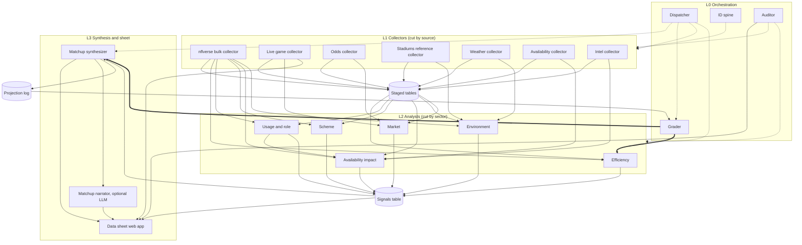

# Architecture

Four layers plus stored tables. Solid arrows are data flow, dotted arrows are triggers,
keys, or monitoring, thick arrows are grading feedback.

## Layer rules (non-negotiable)

- **L0 Orchestration** decides what runs, owns the canonical keys, detects breakage, and
  grades projections.
  - **Dispatcher**: one GitHub Actions cron every ~10 min, reads the schedule/game state
    and `agent_runs`, triggers only what the calendar (see below) needs. Triggers
    nothing in idle windows.
  - **ID spine**: canonical keys for games, teams, players, and a provider ID crosswalk
    (gsis ↔ ESPN ↔ Sleeper ↔ PFR). Every table foreign-keys here. Also fills in
    `player_id_crosswalk.sleeper_id` gaps (fill-null-only) from Sleeper's own
    self-reported `gsis_id`, via a small independently-throttled Sleeper fetch — added
    Phase 3 once the Availability collector's crosswalk-resolution needs surfaced how far
    `load_ff_playerids()` lags current-season rookies/UDFAs (see `docs/sources.md`).
  - **Auditor**: after each run, checks freshness vs. expectation, row-count anomalies,
    schema drift, null spikes. Alerts via GitHub issue or Discord webhook; exposes
    per-domain staleness status for the UI.
  - **Grader**: grades every locked projection after the game, tracks closing-line value
    by signal and sector, writes calibration used by the efficiency analyst and
    synthesizer.

- **L1 Collectors** fetch, validate, and store. They never compute metrics. Cut by
  source, one collector per source family.

- **L2 Analysts** read only stored tables (never external sources) and write only to the
  `signals` table. Cut by sector. **Usage/role** is built in Phase 7 (with Scheme/Intel),
  after Availability impact (Phase 3) — so Availability impact's redistribution logic
  reads raw snap shares (from the nflverse bulk collector's `snaps` table) rather than
  Usage's target/carry shares when it's first built. Once Usage exists in Phase 7, its
  more refined shares become available too; whether Availability impact is revisited to
  consume them is an open question for that phase, not decided here.

- **L3 Synthesis and sheet** reads `signals`, plus the spine's `games` table for identity
  and schedule only (`game_id, season, week, home_team, away_team, gameday, gametime,
  location`), and never calls external sources. The web app reads only our database.
  - **Why `games` is allowed (amended 2026-09-23, P5):** the spine is canonical keys owned
    by L0, not staged source data. A card has to know which teams play, where, and when
    it kicks off (projections lock pre-kickoff), and no signal carries that. Scores,
    lines, and results stay off-limits at runtime. Only the offline model-fitting and
    backtest scripts (`scripts/`) read them, on completed historical seasons.
  - **Matchup synthesizer**: joins signals per game, projects spread/total, compares to
    market, writes edge cards, locks projections pre-kickoff into `projection_log`
    (immutable).
  - **Data sheet web app**: Next.js on Vercel — game view, player view, signal
    cross-reference/filters, matchup cards with sample sizes and staleness badges.
  - **Matchup narrator** (optional, Phase 8): on-demand prose from one card's signals,
    cached per game per day. Cannot introduce numbers not already on the card.

## Piece-by-piece spec

Freshness tiers: **T0** every few minutes, **T1** hourly or several times a day, **T2**
daily, **T3** weekly, **OD** on demand.

### L0 Orchestration

| Piece | Tier | Phase | Job |
|---|---|---|---|
| Dispatcher | T0 | 1 (skeleton), 8 (tuned) | Cron every ~10 min; triggers only what the calendar needs. |
| ID spine | T2 | 1 | Canonical keys via nflreadpy `load_schedules`, `load_teams`, `load_players`, `load_ff_playerids`. |
| Auditor | T0 | 1 (skeleton) | Freshness/row-count/schema/null checks; alerts; staleness status for UI. |
| Grader | T2 | 5 | Grades locked projections; tracks closing-line value; writes calibration. |

### L1 Collectors

| Collector | Source(s) | Reliability | Tier | Phase | Stores |
|---|---|---|---|---|---|
| nflverse bulk | nflreadpy: pbp, player stats, snap counts, NGS, PFR advanced, FTN charting, depth charts | Open data | T2 | 2 | Aggregates only (player_week, team_week, snaps, ngs, ftn, pfr_advstats, depth). **Never raw pbp in Postgres.** `load_team_stats`/`load_rosters` verified but not staged — see `docs/phases/P2.md` deviations. |
| Live game | ESPN scoreboard/game summary (unofficial) | Can break | T0 | 8 | live_games, live_box, espn_lines |
| Odds | The Odds API free tier + ESPN embedded lines | Credit-limited | T1 | 4 | odds_snapshots (append-only) |
| Stadiums reference | `reference/stadiums.csv` (hand-reviewed; coords + field bearing from OpenStreetMap, roof type cited per row) | Hand-maintained | T3 | 4 | stadiums (coords, roof_type, field_bearing, known_names, tz) |
| Weather | Open-Meteo (no key); venue from the `stadiums` table | Open data | T1 | 4 | weather_snapshots (append-only), weather_snapshot_targets; 7 kickoff-relative snapshots per non-fixed-roof game (`weather_schedule.py`) |
| Availability | ESPN injuries, Sleeper players (≤1/day) | Can break | T1 | 3 | injuries, injury_presence |
| Intel (live news) | ESPN NFL news feed, official team RSS where available, Sleeper trending players | Can break | T1 | 7 | news_items (deduped URL+hash), news_tags (rule-based) |

### L2 Analysts (all write to `signals`)

| Analyst | Phase | Signals |
|---|---|---|
| Efficiency | 2 | Opponent-adjusted EPA/play, success rate, explosive rate, points/drive, three-and-out rate, red-zone TD rate, for both offense and defense; pass/rush and down splits; garbage time filtered; prior-and-league blended (see `docs/signals.md`). |
| Availability impact | 3 | Snap-share redistribution, replacement depth-order delta (depth-chart order only, not a quality estimate), OL/secondary cluster counts, practice-trend risk (a designation-change ordinal, injury-category only, requires 2+ distinct days of data — neither ESPN nor Sleeper exposes real Wed/Thu/Fri participation data), and an availability_category label distinguishing injury from non-injury unavailability (exempt/suspension/COVID). Uses raw snap shares (from the nflverse bulk collector's `snaps` table) as the redistribution baseline, since Usage/role (Phase 7) isn't built yet at this phase. |
| Market | 4 | Open vs. current line, movement velocity, implied team totals, key-number crossings. No "sharp money" claims. Per game, same rolling window as Environment. market_status separates movement / single capture / lookahead-only / awaiting / missed. Open = the earliest capture from the game's own week's targets, never a lookahead poll from the prior week, with an on-time/late/fallback basis. Current = the latest pre-kickoff capture. Spread/total open, current, move, and per-day rate, with a book-set-changed guard and book counts at both ends. Cross-book range, key crossings (3/7/10/14, strictly through), a per-book key straddle, implied team totals, and proportionally de-vigged moneyline win probability. See `docs/signals.md`. |
| Environment | 4 | Per game, for every game kicking off in a rolling window (−24h..+7d) rather than the dispatcher's week: weather_status (distinguishes forecast / indoor / awaiting / missed / venue unresolved / not tracked), headline weather from the latest pre-kickoff snapshot (wind speed as the base shape, along-field/crosswind split only ≥8 mph at venues with a field bearing; temperature, precip, snow, lead time, HRRR-domain confidence, grid elevation as altitude), roof and surface codes, and per-team rest days/differential, travel miles, and timezone shift (home venue tz vs. game venue tz, wrapped to ±12h). See `docs/signals.md`. |
| Usage and role | 7 | Snap share, target share, air-yards share, red-zone/goal-line share, carry share, WoW deltas. |
| Scheme | 7 | Pass rate over expected, neutral pace, play-action/motion rate, box counts, blitz/pressure rate, approximate personnel (labeled). |

### L3 Synthesis and sheet

| Piece | Phase | Job |
|---|---|---|
| Matchup synthesizer | 5 | Adjusted efficiency → points regression, backtested vs. historical closing lines (`docs/backtest_report.md`). **T1.** Per game, same −24h..+7d window as Environment and Market. Writes one `matchup_cards` row per game until kickoff, then the card freezes. Locks the projection into `projection_log` on the first run within 6h of kickoff; a DB trigger makes that row immutable. Edges are vs. Market's current consensus, flagged rather than adjusted; `edge_validated` is false (not shown to beat the close). Model file: `pipeline/synthesis/model_coefficients.json`, refit manually. |
| Data sheet web app | 6 | Next.js + TypeScript on Vercel. |
| Matchup narrator | 8, optional | Cached prose per game per day, numbers-locked to the card. |

## Dispatcher calendar (ET)

| Day | Runs |
|---|---|
| Tue | Efficiency rebuild incl. MNF; opening odds snapshot; grader closes last week |
| Wed | Practice report 1; availability impact; morning odds |
| Thu | nflverse stat-correction re-pull; authoritative efficiency rebuild; practice report 2; pre-TNF odds; TNF live window |
| Fri | Practice report 3 + game statuses; availability impact; morning odds; draft Sunday cards |
| Sat | Status changes/elevations; morning odds; market movement; auditor pre-Sunday sweep |
| Sun | Weather snapshots per game at T-48/36/24/18/12h plus wide T-6h..T-2h and T-2h..kickoff+1h buckets (all days, non-fixed-roof venues; see P4); odds 9:00/12:30/3:45/pre-SNF; lock projections pre-kickoff; live windows; grade finished games |
| Mon | nflverse Sunday data; usage/snap updates; pre-MNF odds; MNF live window |

Live polling runs as **one looping job per game window**, not a new job every few
minutes.

## Deviations from the original kickoff brief

- **Usage/role is back in Phase 7, its original slot (2026-09-17).** A prior version of
  this plan moved it to Phase 2 alongside a new Matchup history sector, reasoning that
  both only needed the nflverse bulk collector and that sequencing Usage before
  Availability impact (Phase 3) would let Availability impact consume Usage's
  target/carry shares directly instead of falling back to raw snap shares. That move was
  reverted: Phase 2 is Efficiency only. Availability impact (Phase 3) uses raw snap
  shares (from the nflverse bulk collector's `snaps` table) as its redistribution
  baseline — the original arrangement — rather than waiting on Usage. Whether Availability
  impact is revisited to consume Usage's shares once Phase 7 exists is an open question,
  not decided here.
- **Matchup history is cut from the plan entirely**, not just moved. It was never in the
  original `KICKOFF.md` brief — it was proposed during P1/P2 planning as a low-sample,
  high-value addition drawing on the same staged tables as Efficiency/Usage, but was
  removed (2026-09-17) rather than built or rehomed to another phase.
- The nflverse bulk collector (Phase 2) also stages `pfr_advstats` (PFR advanced stats,
  tag `pfr_advstats`) — not in the original table list, added because the phase's own
  scope line named "PFR advanced" as a source to fetch. Not consumed by the Efficiency
  analyst; available for Usage/Scheme (Phase 7) or later refinement. `load_team_stats`
  and `load_rosters` were live-verified but are not staged — see `docs/phases/P2.md`'s
  deviations for why.
- **Availability's `practice_status` table was dropped from the Phase 3 plan (2026-09-17)**
  — live verification found neither ESPN's injuries feed nor Sleeper's player dump
  exposes structured per-day (Wed/Thu/Fri) practice-participation data, so a table named
  for that concept would have been mostly null. Folded into `injuries` instead: one
  append-only snapshot row per (player, collector run), from which
  `practice_trend_risk` is derived as a designation-change ordinal — the honest
  substitute for real participation data. NFL.com injury-report scraping (the one source
  that could supply real participation data) stays deliberately out of scope; see
  `docs/sources.md`'s Availability section.
