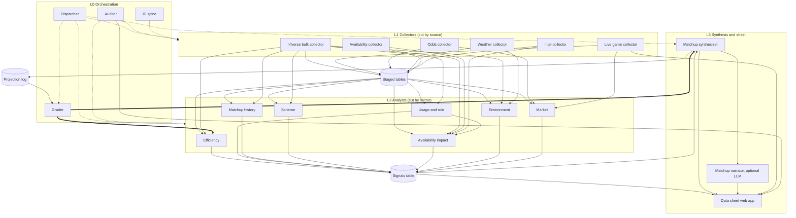

# Architecture

Four layers plus stored tables. Solid arrows are data flow, dotted arrows are triggers,
keys, or monitoring, thick arrows are grading feedback.

## Layer rules (non-negotiable)

- **L0 Orchestration** decides what runs, owns the canonical keys, detects breakage, and
  grades projections.
  - **Dispatcher**: one GitHub Actions cron every ~10 min, reads the schedule/game state
    and `agent_runs`, triggers only what the calendar (see below) needs. Triggers
    nothing in idle windows.
  - **ID spine**: canonical keys for games, teams, players, and a provider ID crosswalk
    (gsis ↔ ESPN ↔ Sleeper ↔ PFR). Every table foreign-keys here.
  - **Auditor**: after each run, checks freshness vs. expectation, row-count anomalies,
    schema drift, null spikes. Alerts via GitHub issue or Discord webhook; exposes
    per-domain staleness status for the UI.
  - **Grader**: grades every locked projection after the game, tracks closing-line value
    by signal and sector, writes calibration used by the efficiency analyst and
    synthesizer.

- **L1 Collectors** fetch, validate, and store. They never compute metrics. Cut by
  source, one collector per source family.

- **L2 Analysts** read only stored tables (never external sources) and write only to the
  `signals` table. Cut by sector. **Usage/role** and **Matchup history** run as soon as
  the nflverse bulk collector exists (Phase 2) — neither needs a new external source, and
  Availability impact (Phase 3) depends on Usage's target/carry shares, so both are
  sequenced before it rather than bundled with Scheme/Intel later.

- **L3 Synthesis and sheet** reads `signals` and never calls external sources. The web
  app reads only our database.
  - **Matchup synthesizer**: joins signals per game, projects spread/total, compares to
    market, writes edge cards, locks projections pre-kickoff into `projection_log`
    (immutable).
  - **Data sheet web app**: Next.js on Vercel — game view, player view, signal
    cross-reference/filters, matchup cards with sample sizes and staleness badges.
  - **Matchup narrator** (optional, Phase 8): on-demand prose from one card's signals,
    cached per game per day. Cannot introduce numbers not already on the card.

## Piece-by-piece spec

Freshness tiers: **T0** every few minutes, **T1** hourly or several times a day, **T2**
daily, **T3** weekly, **OD** on demand.

### L0 Orchestration

| Piece | Tier | Phase | Job |
|---|---|---|---|
| Dispatcher | T0 | 1 (skeleton), 8 (tuned) | Cron every ~10 min; triggers only what the calendar needs. |
| ID spine | T2 | 1 | Canonical keys via nflreadpy `load_schedules`, `load_teams`, `load_players`, `load_ff_playerids`. |
| Auditor | T0 | 1 (skeleton) | Freshness/row-count/schema/null checks; alerts; staleness status for UI. |
| Grader | T2 | 5 | Grades locked projections; tracks closing-line value; writes calibration. |

### L1 Collectors

| Collector | Source(s) | Reliability | Tier | Phase | Stores |
|---|---|---|---|---|---|
| nflverse bulk | nflreadpy: pbp, player/team stats, snap counts, NGS, PFR advanced, FTN charting, depth charts, rosters | Open data | T2 | 2 | Aggregates only (player_week, team_week, snaps, ngs, ftn, depth). **Never raw pbp in Postgres.** |
| Live game | ESPN scoreboard/game summary (unofficial) | Can break | T0 | 8 | live_games, live_box, espn_lines |
| Odds | The Odds API free tier + ESPN embedded lines | Credit-limited | T1 | 4 | odds_snapshots (append-only) |
| Weather | Open-Meteo (no key) + stadium coords/roof/surface | Open data | T1 | 4 | weather_snapshots (append-only), outdoor only |
| Availability | ESPN injuries, Sleeper players (≤1/day), NFL.com injury reports | Can break | T1 | 3 | injuries, practice_status, transactions |
| Intel (live news) | ESPN NFL news feed, official team RSS where available, Sleeper trending players | Can break | T1 | 7 | news_items (deduped URL+hash), news_tags (rule-based) |

### L2 Analysts (all write to `signals`)

| Analyst | Phase | Signals |
|---|---|---|
| Efficiency | 2 | Opponent-adjusted EPA/play, success rate, explosive rate, points/drive, three-and-out rate, red-zone TD rate; pass/rush and down splits; garbage time filtered; prior-blended. |
| Usage and role | 2 | Snap share, target share, air-yards share, red-zone/goal-line share, carry share, WoW deltas. Feeds Availability impact. |
| Matchup history | 2 | Player vs. specific opponent historical performance (recency-weighted across meetings), team vs. division/rival trends, home/away-vs-opponent-type splits. Sample sizes are usually small (1–2 meetings/season) — `stability` reflects this and the UI must show `sample_n` alongside the value. |
| Availability impact | 3 | Target/carry redistribution, replacement quality gap, OL/secondary cluster flags, practice-trend risk. Uses Usage's target/carry shares (Phase 2) rather than raw snap shares. |
| Market | 4 | Open vs. current line, movement velocity, implied team totals, key-number crossings. No "sharp money" claims. |
| Environment | 4 | Wind/precip flags for passing/kicking, dome/outdoor, surface, altitude, rest differential, travel distance, timezone crossings. |
| Scheme | 7 | Pass rate over expected, neutral pace, play-action/motion rate, box counts, blitz/pressure rate, approximate personnel (labeled). |

### L3 Synthesis and sheet

| Piece | Phase | Job |
|---|---|---|
| Matchup synthesizer | 5 | Adjusted efficiency → points regression, backtested vs. historical closing lines. |
| Data sheet web app | 6 | Next.js + TypeScript on Vercel. |
| Matchup narrator | 8, optional | Cached prose per game per day, numbers-locked to the card. |

## Dispatcher calendar (ET)

| Day | Runs |
|---|---|
| Tue | Efficiency rebuild incl. MNF; opening odds snapshot; grader closes last week |
| Wed | Practice report 1; availability impact; weather 3×/day begins; morning odds |
| Thu | nflverse stat-correction re-pull; authoritative efficiency rebuild; practice report 2; pre-TNF odds; TNF live window |
| Fri | Practice report 3 + game statuses; availability impact; morning odds; draft Sunday cards |
| Sat | Status changes/elevations; morning odds; market movement; auditor pre-Sunday sweep |
| Sun | Weather hourly (outdoor only); odds 9:00/12:30/3:45/pre-SNF; lock projections pre-kickoff; live windows; grade finished games |
| Mon | nflverse Sunday data; usage/snap updates; pre-MNF odds; MNF live window |

Live polling runs as **one looping job per game window**, not a new job every few
minutes.

## Deviations from the original kickoff brief

- **Usage/role and Matchup history moved from Phase 7 to Phase 2.** Reason: both only
  need the nflverse bulk collector (already built in Phase 2), no new external source.
  Availability impact (Phase 3) already depended on Usage's shares and was falling back
  to raw snap shares in the original ordering — sequencing Usage before it removes that
  workaround. Matchup history is new (not in the original brief); it's a low-sample,
  high-value addition to the "extensive per-player/matchup data" goal, so it's grouped
  with Usage since it draws on the same staged tables.
